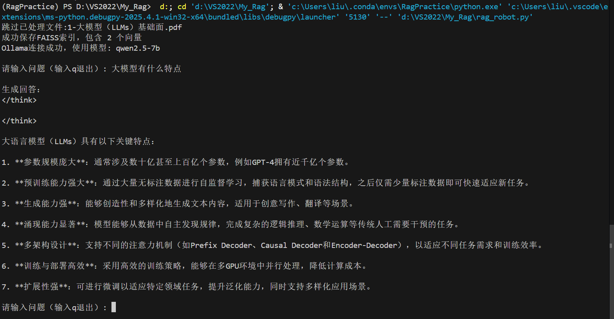

# RAG 智能问答机器人

一个基于检索增强生成（RAG）的智能问答系统，支持本地模型和API服务，可处理多种文档格式并实现精准上下文检索。

  

---

## 功能特性

- **多格式文档支持**：支持处理 PDF、Word、Excel、TXT、JSON 等格式
- **混合模型架构**：支持本地 Ollama 模型、DeepSeek API 等多种后端
- **智能检索**：基于 FAISS 向量数据库实现高效语义检索
- **增量处理**：自动跳过已处理文件，支持增量数据更新
- **容错机制**：自动处理文档编码差异和异常文件

---

## 快速开始

### 环境要求
- Python 3.8+
- NVIDIA GPU（推荐，如需本地模型推理）

### 安装步骤
```bash
# 克隆仓库
git clone https://github.com/liu9920ai/My_Rag.git
cd My_Rag

# 安装依赖
pip install -r requirements.txt

# 安装文档处理依赖（可选）
pip install pdfplumber python-docx openpyxl
```

### 数据准备
1. 在项目根目录创建 `data_to_process` 文件夹
2. 将需要处理的文档（PDF/Word/Excel/TXT 等）放入该目录

### 运行系统
```bash
python chat_robot.py
```

---

## 配置指南

### 模型选择
在 `chat_robot.py` 中修改配置：
```python
rag = RAGSystem(
    use_deepseek_api=False,  # 切换为 True 使用 DeepSeek API
    use_ollama=True,        # 使用本地 Ollama 服务
    ollama_model="qwen2.5-7b"  # 本地模型名称
)
```

### API 密钥配置
如需使用 DeepSeek API：
1. 在[DeepSeek 平台](https://platform.deepseek.com/)获取 API Key
2. 创建 `.env` 文件：
```ini
DEEPSEEK_API_KEY=your_api_key_here
```

---

## 项目结构
```
├── data_to_process/        # 原始文档存放目录
├── processed_data/         # 处理后的向量数据库
├── chat_robot.py           # 主程序入口
├── data_processing.py      # 文档处理与向量化模块
├── rag_robot.py            # RAG 系统核心逻辑
└── ollamatest.py           # Ollama 连接测试脚本
```

---

## 使用示例
```bash

# 首次运行会自动预处理文档
>>> 用户: 人工智能有哪些主要应用领域?

>>> 助手: 人工智能主要应用领域包括...
```

---

## 高级功能

### 自定义处理规则
在 `data_processing.py` 中修改：
- `text_split()`：调整文本分割策略
- `ALLOWED_EXTENSIONS`：扩展支持的文件类型
- `batch_size`：优化向量化批处理大小

### 性能调优
```python
# 在 RAGSystem 初始化时添加
torch.set_num_threads(4)          # 设置CPU线程数
faiss.omp_set_num_threads(4)      # 设置FAISS并行度
```

---

## 常见问题

Q: 如何处理加密PDF？  
A: 系统会自动跳过加密文档并在控制台提示

Q: 如何重置处理进度？  
A: 删除 `processed_data/` 目录并重新运行

Q: Ollama 服务未响应怎么办？  
A: 请确保已正确安装并运行 [ollama](https://zhuanlan.zhihu.com/p/720546185)

欢迎加我[QQ](https://qm.qq.com/q/fUZH3NVcf6)交流学习

---
# todo list
## 1.关于大模型的prompt制作问题
- 现阶段措施：目前只是将搜索到的向量及索引对应文本段简单的堆砌在一起丢给大模型。
```python
prompt:
{
    """基于以下上下文信息，请用中文给出专业、详细的回答。
        如果无法从上下文得到明确答案，请如实说明。
        上下文：
        {context}
        问题：{question}
        专业回答："""
}
```
- 下一步方向：更具有结构性的prompt(比如组合为带文件名的json格式)的实现。
```python
prompt:
{
    "搜索到的文本":{
        "txt1_name":LLm具有...
        "txt2_name":LLm应该...
        "txt3_name":LLm可以...
        "txt4_name":LLm能够...
    },
    "问题":{question},
    专业回答：
}
```
## 2.优化大模型上下文长度限制
- 1. **创建临时数据库** ：通过将上下文存储在临时数据库中，在询问时加入向量搜索机制来实现缩短上下文的目的。
- 2. **大模型浓缩语义** ：利用大模型对上下文的语义进行精炼提取，缩短上下文长度（可能会造成较多信息损失）。
- 3. **自训练浓缩模型** ：训练NLP模型对语义进行提取精炼，针对性更强，难度较高。
## 3.对于图片的处理
- 当前思路：当前没有对图片的处理功能
- 后续规划：
- - 1. 引入OCR图像处理技术，提取图片文字内容。
- - 2. 寻找可以分析图片内容的模型，将图片内容转换为文本，加入到文本数据库中。
- - 3. 寻找可以同时对图片或者模型进行embedding的模型（是否存在？），直接存储图片，同时在回答时直接使用可以理解图片的大模型。
## 终极狂想
对于<b>所有输入</b>（文本，图片，视频，音频...）均可以直接过embedding模型后依据向量存储，使用时直接根据用户的问题进行搜索，丢给可以理解所有输入的模型后的到最准确的回答

---
## 许可协议
本项目采用 [MIT License](LICENSE)
